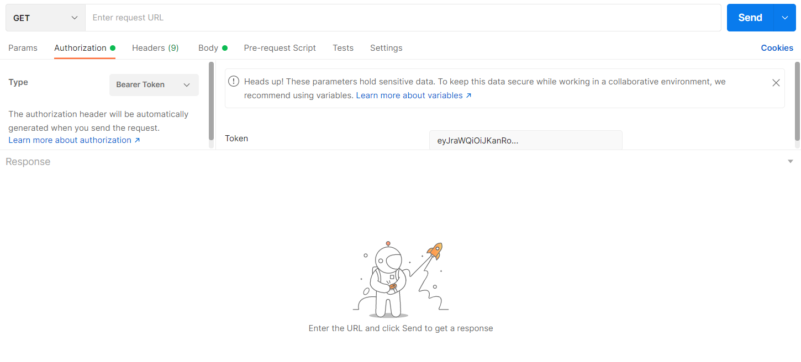

# Authentication

Authentication is done via [HTTP Authentication Bearer](https://developer.mozilla.org/en-US/docs/Web/HTTP/Headers/Authorization). The user should provide `AccessToken` to the Authorization as headers for requests that required authentication.

## Authorization Header

If the `AccessToken` is required for the route, then the user should set the `Authorization` header as follows:
```
Authorization: Bearer {AccessToken}
``` 

## Axios

In axios, we can pass directly the `AccessToken` to the [request config](https://www.npmjs.com/package/axios#request-config) as follow:
```json
{
  "headers": {
    "Authorization": "Bearer eyJraWQiOiJKanRo..."
  }
}
```

## Postman

